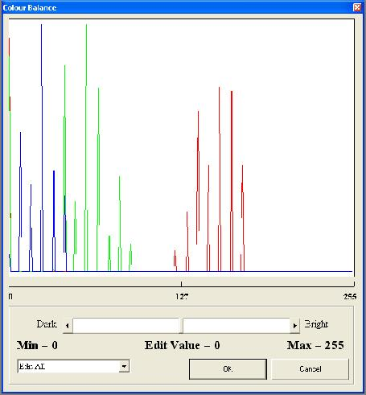



## Advanced Image Editing Tools

### Description

Advanced Image Editing Tools - invert, engrave, emboss, brighten, colour to mono, midday, mosaic, neon, sharpen, smooth, colour balancing, tone balancing, plus more...
 
### More Info
 

             |
---                |---
**Submitted On**   |2002-07-30 23:25:00
**By**             |[Ross](https://github.com/Planet-Source-Code/PSCIndex/blob/master/ByAuthor/ross.md)
**Level**          |Advanced
**User Rating**    |4.6 (23 globes from 5 users)
**Compatibility**  |VB 5\.0, VB 6\.0
**Category**       |[Graphics](https://github.com/Planet-Source-Code/PSCIndex/blob/master/ByCategory/graphics__1-46.md)
**World**          |[Visual Basic](https://github.com/Planet-Source-Code/PSCIndex/blob/master/ByWorld/visual-basic.md)
**Archive File**   |[Advanced\_I1126457302002\.zip](https://github.com/Planet-Source-Code/ross-advanced-image-editing-tools__1-37418/archive/master.zip)

